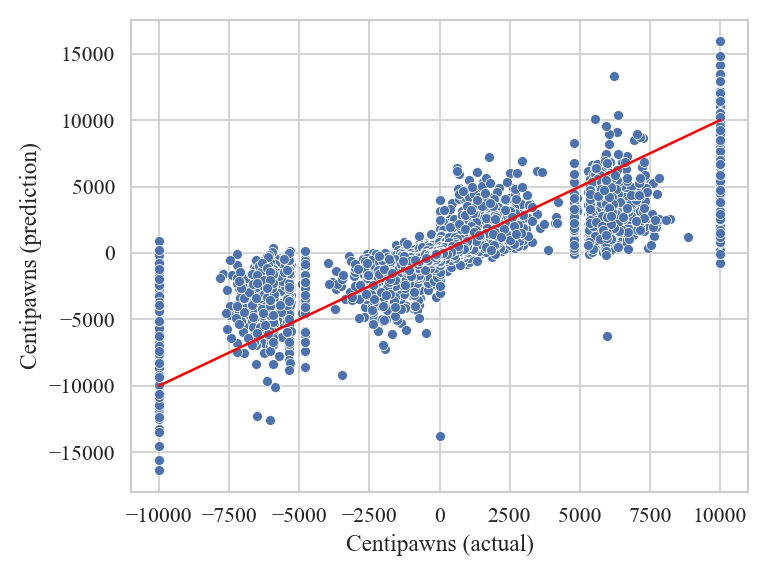

# CSC413/2516 Final Project: Evaluating Chess Positions using Convolutional Neural Networks


This repository contains our final project for the course [Neural Networks and Deep Learning](https://uoft-csc413.github.io/2023/) by Jimmy Ba and Bo Wang at the University of Toronto.

## Installing dependencies
Run `pip install -r requirements.txt` to install all the dependencies.

## Evaluating a chess position
Pass the board position in FEN-notation as a string into `eval.py`. Example:
```bash
python eval.py "r1bqkb1r/pppp1ppp/2n2n2/1B2p3/4P3/5N2/PPPP1PPP/RNBQK2R"
```
This uses the model trained on the full dataset for 23 epochs.
See the final report (`report.pdf`) for more detail.

## Training the model
### Dataset
You have two options: Prepare a certain percentage of the dataset yourself, or download
5% of the dataset preprocessed.

#### Download 5% preprocessed dataset
The prepared dataset can be downloaded using [this link](https://drive.google.com/file/d/1tWDLtThdnAhZGlFq_yN_kd3Gn9Q2Yqld/view?usp=share_link).
Please extract the files into the `data_preparation` subdirectory.

#### DYI
The unprocessed dataset `chessData.csv` (taken from [Kaggle](https://www.kaggle.com/datasets/ronakbadhe/chess-evaluations))
can be downloaded using [this link](https://drive.google.com/file/d/1Ar7sU1Y-2MCxhwcC6P_woSIDf3KDHPgP/view?usp=share_link).
After downloading the dataset, proceed as follows:

1. `mv chessData.csv data_preparation`
2. `cd data_preparation`
3. `python prep.py`

This will prepare 5% of the dataset for you, which will take 25 minutes and 2.5GB of disk space.
Feel free to change the percentage of the dataset at the bottom of `prep.py`: The second parameter
of the call `StockFishDataPreparation("./chessData.csv", 0.05)`.

**Please note: The full dataset takes about 50GB of disk space**

### Run Training
After the dataset has been downloaded or prepared, you can run
`train.py` to start training the model.
```bash
python train.py
```